#  Sistema Inteligente de Gestão de Estoque (JSON & BARCODE)

> **Uma solução IoT para varejo que integra pesagem de precisão, identificação por codigo de barras e precificação dinâmica baseada na validade do produto.**

[](#)

[](#)
[](#)
[](https://sites.google.com/cesar.school/projeto1-g14/sr/sr2)

<p align="center">
  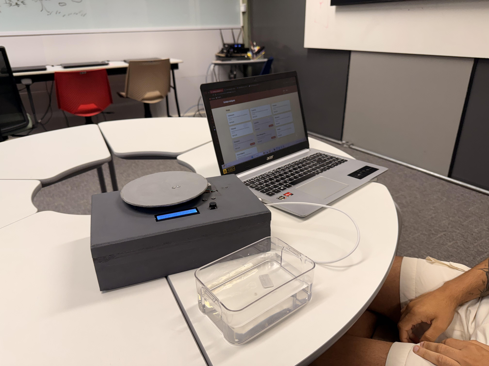
</p>

## Sobre o Projeto

É uma balança inteligente desenvolvida para combater o desperdício em supermercados e comércios. Utilizando um **ESP32** como controlador central, o sistema identifica produtos via **Codigo de Barras**, consulta seus dados (validade, preço, nome) em um banco de dados **JSON** e cruza essas informações com o peso real na balança.

Se o produto estiver próximo da data de vencimento, o sistema aplica automaticamente um **Desconto Dinâmico**, incentivando a venda imediata.

**Diário de Bordo e Documentação:** [Google Sites - Grupo 14](https://sites.google.com/cesar.school/projeto1-g14/sr/sr2)

---
#  Processo de Construção – G14  
Documentação das etapas de desenvolvimento do **Site Cardápio Inteligente** e da **Montagem da Balança**, incluindo decisões tomadas ao longo do projeto.

---

## Montagem do Site Cardápio Inteligente
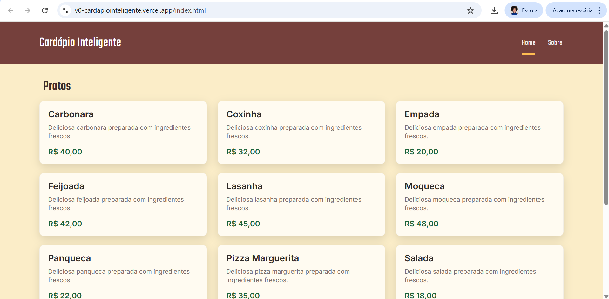


###  1ª versão do Site e processo de desenvolvimento
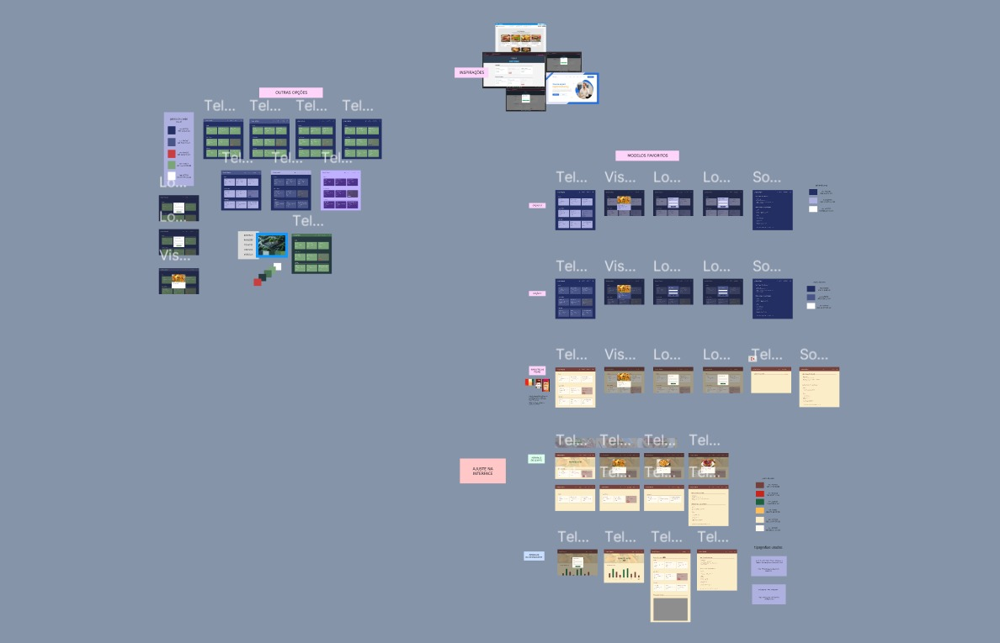
- Criação inicial da estrutura do site  
- Definição do fluxo de navegação  
- Implementação das primeiras telas funcionais  
- Testes de layout e responsividade  

###  Melhoria do Design de Interface (UI)
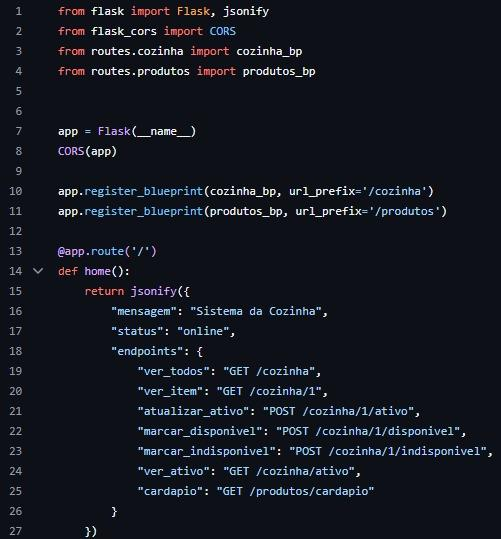
Durante o desenvolvimento, foi realizada uma reformulação completa da interface, visando:
- Mais clareza visual  
- Navegação mais simples  
- Melhor hierarquia das informações  
- Paleta de cores mais consistente  

**Link do Figma:**  
https://www.figma.com/design/YAeyH8sbb4jjZEpCfHgT36/UI---Site-Card%C3%A1pio-Inteligente?node-id=0-1&t=7JDPTBkvQW52W1TR-1

---

##  Desenvolvimento do Cardápio Inteligente e Integração com a Balança
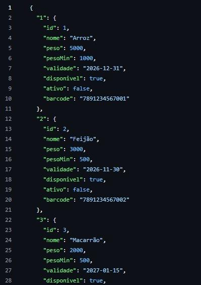
- Comunicação entre ESP32 e sistema web  
- Leitura de códigos de barras e busca nos bancos de dados JSON  
- Leitura de peso pela célula de carga (HX711)  
- Atualização dinâmica dos itens no cardápio conforme ingredientes disponíveis  
- Integração com o site para exibir pratos, estoques e alertas  

---

## 2ª versão do Site Cardápio Inteligente (versão final)


- UI reformulada  
- Navegação mais fluida  
- Design responsivo  
- Ajustes baseados na integração com hardware  

 **Link do Cardápio Inteligente (deploy):**  
https://v0-cardapiointeligente.vercel.app/index.html

---

# Montagem da Balança Inteligente
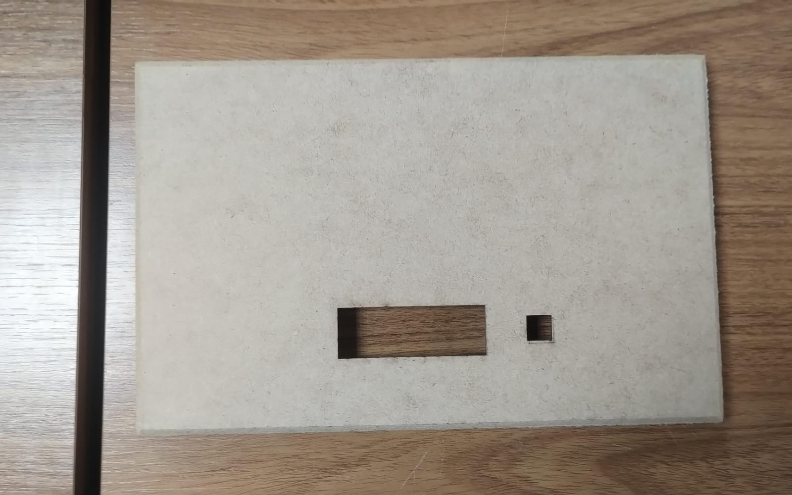


###  Corte da caixa de MDF
- Abertura para o **botão** e para o **display LCD**  
- Corte realizado com **máquina laser** para maior precisão  

###  Pintura da caixa
- Pintura em **cinza** para melhorar estética e durabilidade  
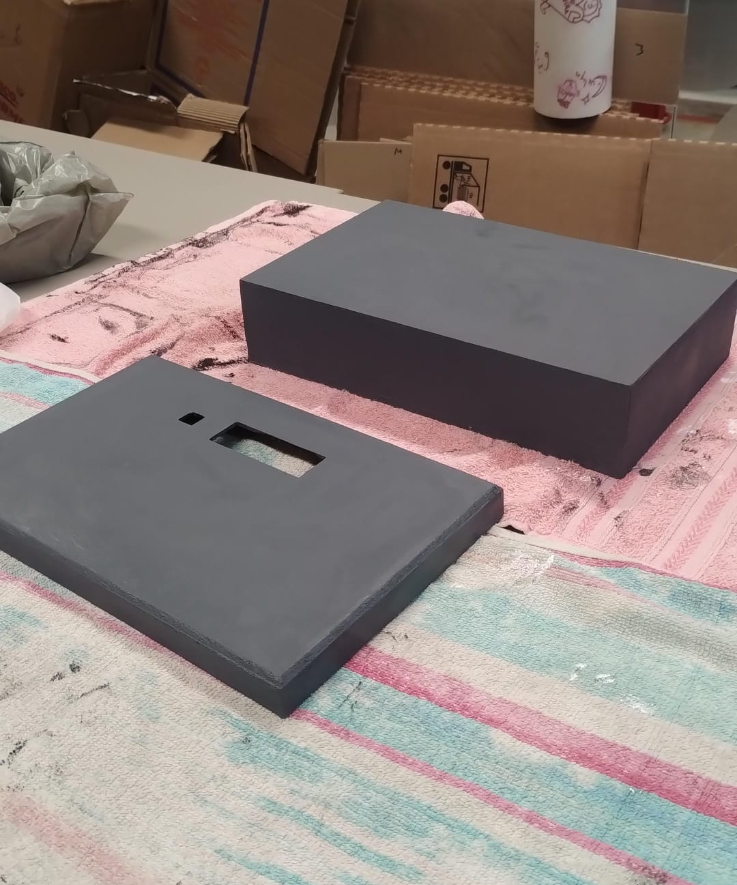
###  Idealização e diagrama eletrônico
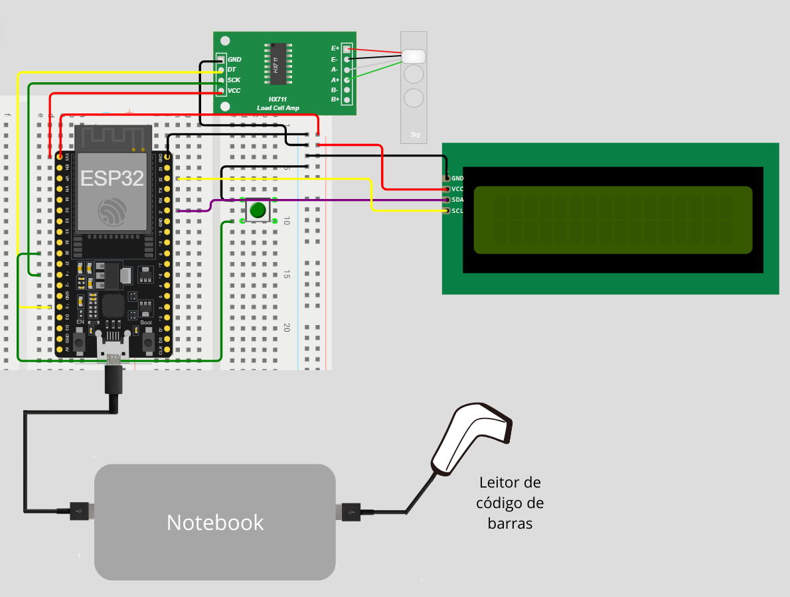
- Desenvolvimento do esquema elétrico com:
  - ESP32  
  - Módulo HX711  
  - Célula de carga  
  - Botão de interação  
  - Display LCD  


###  Instalação dos componentes na tampa
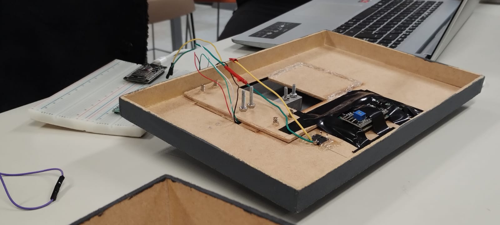
- Fixação da célula de carga  
- Montagem do módulo HX711  
- Instalação do botão  
- Montagem do LCD  

###  Ajustes da tampa da balança
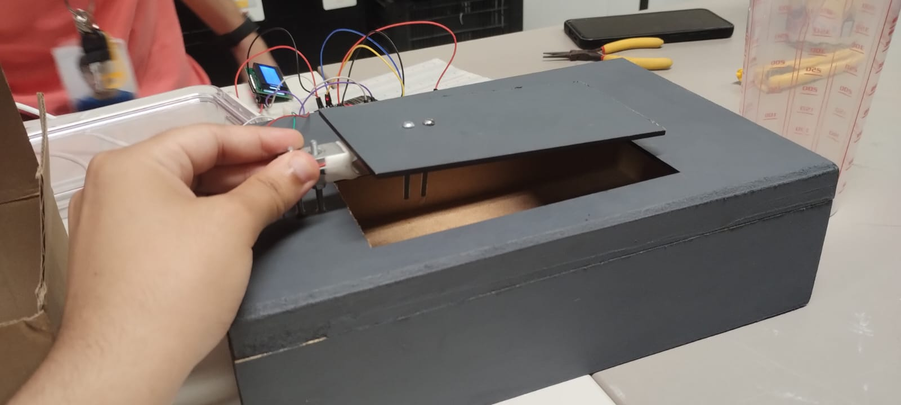
- Corte da tampa original e tentativa de reaproveitamento (1ª tentativa) 
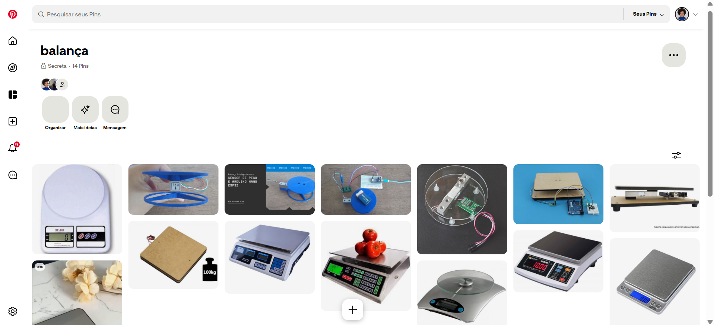 
- Pesquisa de referências e sistemas de apoio para manter a tampa estável 
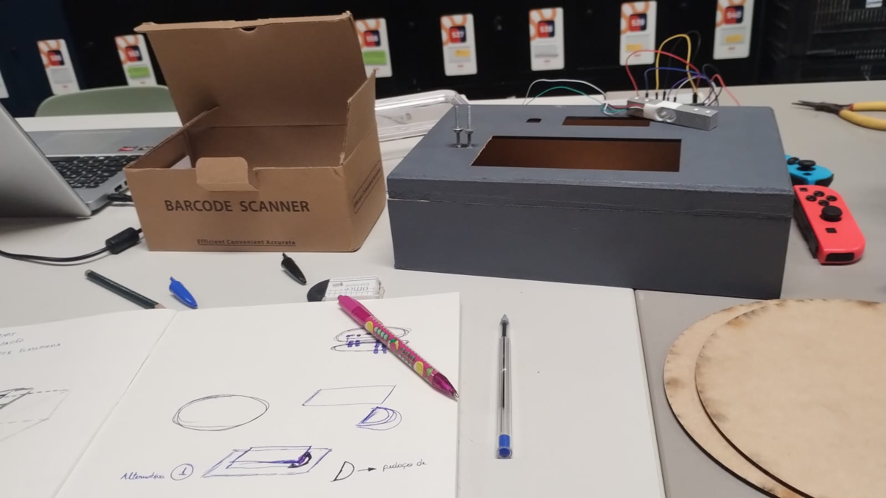
- Criação de esboços para melhorar firmeza e durabilidade  


###  Fixação da célula de carga
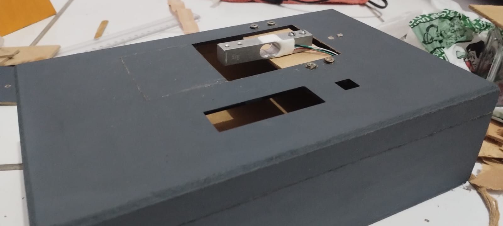
- Instalação de uma peça extra de MDF, parafusada no centro para:
  - Firmar a célula de carga  
  - Evitar torções na medição  
  - Melhorar a estabilidade  

###  Criação de novas tampas

- Desenvolvimento de **duas novas versões de tampa** (2ª e 3ª tentativa) 

   
- Testes de:
  - Estabilidade  
  - Peso distribuído  
  - Precisão da medição  
- **Escolha final:** a **tampa redonda** desenvolvida entre as alternativas

---


## Funcionalidades

* **Identificação Automática:** Leitura de tags em codigo de barras para carregar instantaneamente as configurações do produto (tara, preço/kg).
* **Banco de Dados JSON:** Armazenamento flexível e estruturado das informações dos produtos.
* **Pesagem de Alta Precisão:** Monitoramento em tempo real via célula de carga e módulo HX711.
* **Precificação Dinâmica:**
    * Verifica a data de validade no JSON.
    * Calcula dias restantes.
    * Aplica desconto (ex: 20% OFF) automaticamente se estiver perto de vencer.
* **Feedback Visual:** Display LCD informa o cliente sobre o produto, peso e se há desconto aplicado.

---

##  Estrutura dos Bancos de Dados (JSON)

O sistema utiliza **3 bancos de dados distintos**, cada um cumprindo uma função específica:

- **cozinha.json** → Itens utilizados no preparo interno (insumos da cozinha)  
- **estoque.json** → Produtos armazenados com controle de validade, peso e quantidade  
- **pratos.json** → Pratos prontos que combinam ingredientes listados por ID  

Abaixo está a documentação completa de cada estrutura.

---

###  1. cozinha.json  
Representa **insumos internos da cozinha**, geralmente itens de grande volume (ex: sacos de arroz, caixas, fardos).

####  Estrutura dos itens (exemplo real enviado):
```json
{
  "1": {
    "id": 1,
    "nome": "Arroz",
    "peso": 5000,
    "pesoMin": 1000,
    "validade": "2026-12-31",
    "disponivel": true,
    "ativo": false,
    "barcode": "7891234567001"
  }
}
```
##  Descrição dos campos

| Campo      | Tipo                   | Descrição                                   |
|------------|-------------------------|-----------------------------------------------|
| id         | número                 | Identificador único do ingrediente           |
| nome       | string                 | Nome do item usado na cozinha               |
| peso       | número                 | Peso total disponível (em gramas)           |
| pesoMin    | número                 | Peso mínimo para alerta de reposição        |
| validade   | string (YYYY-MM-DD)    | Data de validade                            |
| disponivel | boolean                | Se o item está disponível para uso          |
| ativo      | boolean                | Se está sendo monitorado pela balança       |
| barcode    | string                 | Código de barras usado para identificação   |

##  2. estoque.json

Itens armazenados individualmente, com controle de quantidade, peso por unidade e validade.

###  Estrutura real enviada:
```json
{
  "queijo": {
    "id": 1,
    "pesoMin": 100,
    "peso": 100,
    "validade": "2025-10-30",
    "quantidade": 3,
    "barcode": "7891234567890"
  },
  "tomate": {
    "id": 2,
    "pesoMin": 10,
    "peso": 20,
    "validade": "2026-10-30",
    "quantidade": 20,
    "barcode": "7891234567891"
  },
  "frango": {
    "id": 444,
    "pesoMin": 20,
    "peso": 50,
    "validade": "2026-10-31",
    "quantidade": 1,
    "barcode": "7891234567892"
  }
}
```
##  Campos

| Campo      | Tipo    | Descrição                           |
|------------|---------|---------------------------------------|
| id         | número  | ID do item                           |
| pesoMin    | número  | Peso mínimo antes de alerta          |
| peso       | número  | Peso individual do item (g)          |
| validade   | string  | Data de validade                     |
| quantidade | número  | Quantidade em estoque                |
| barcode    | string  | Código de barras                     |

##  3. pratos.json

Define pratos prontos do cardápio, listando ingredientes por ID e preço base.

###  Estrutura real enviada:
```json
{
  "pizza_marguerita": {
    "ingredientes": ["4", "5", "15"],
    "preco_base": 35.0,
    "desc": "Pizza clássica italiana com molho de tomate, queijo mussarela derretido e manjericão fresco"
  }
}
````
##  Campos

| Campo        | Tipo   | Descrição                                      |
|--------------|--------|-------------------------------------------------|
| ingredientes | array  | IDs de ingredientes dos outros JSONs           |
| preco_base   | número | Preço inicial do prato                         |
| desc         | string | Descrição do prato                             |

##  Frontend

O **frontend** ,
0
 é responsável por oferecer uma interface amigável para o usuário final.  
Ele permite:

- Visualizar em tempo real os dados enviados pelo hardware (peso, produto, validade, desconto aplicado).  
- Acompanhar métricas de desperdício evitado e consumo eficiente.  
- Exibir dashboards com gráficos e relatórios.  
- Alertar o usuário sobre produtos próximos da validade.  

### Tecnologias utilizadas

- React.js (ou framework utilizado)  
- HTML5, CSS3  
- Axios/Fetch para comunicação com o backend  
- Chart.js/Recharts para visualização de dados
##  Lista de Materiais (Hardware)

Para reproduzir este projeto, você precisará dos seguintes componentes:

| Componente            | Quantidade | Descrição                                      |
|----------------------|-----------|------------------------------------------------|
| ESP32 DevKit V1      | 1         | Microcontrolador principal                     |
| Célula de Carga      | 1         | Sensor de peso (ex: 5kg ou 10kg)               |
| Módulo HX711         | 1         | Amplificador para a célula de carga            |
| Leitor De Codigo de Barras    | 1         | Leitura dos codigos dos alimentos                          |
| Display LCD 16x2 (I2C)| 1        | Display com adaptador I2C soldado              |
| Protoboard & Jumpers | 1         | Para conexões do circuito, 2 protoboard para suprir a necessidade                     |
| Botao     | 1         | Botão para alternar os modos do visor, soldados e fixados na caixa
| Caixa mdf     | 1         | caixa sobre medida para suportar o circuito, com furos para o visor lcd, para o botao e para passar o cabo usb-c
| cabo usb-c    | 1         | Cabo para alimentar o esp     

---

##  Pinagem (Wiring)

Abaixo está o mapa de conexões padrão utilizado no código:

---

### **1. Módulo HX711 (Balança)**

| Pino HX711 | Pino ESP32 |
|------------|------------|
| DT (Data)  | GPIO 13     |
| SCK (Clock)| GPIO 14    |
| VCC        | 3.3V ou 5V |
| GND        | GND        |

---


### **2. Display LCD (I2C)**

| Pino LCD | Pino ESP32 |
|----------|------------|
| SDA      | GPIO 21  |
| SCL      | GPIO 22 |

### **3. Botão**
| Pino botão (Pullup)| Pino ESP32 |
|----------|------------|
|       | GPIO 26  |
| GND      | GND |
##  Instalação e Execução

### Pré-requisitos
- Arduino IDE **ou** VS Code + PlatformIO  
- Driver da placa **ESP32** instalado na IDE

---

###  Bibliotecas Necessárias  
Instale as seguintes bibliotecas através do **Library Manager** da sua IDE:
- **Arduino JSON**
- **HX711** (Bogdan Necula)  
- **LiquidCrystal_I2C** (Frank de Brabander)

---

### Passo a Passo

## 1. **Clone o repositório**

```bash
git clone https://github.com/teuss96/cardapio_inteligente
```
## 2. **Abra o projeto na sua IDE preferida**  
Use Arduino IDE ou VS Code + PlatformIO

---

## 3. Configure os bancos de dados JSON

Edite os arquivos dentro da pasta `/data/`:

- **cozinha.json**
- **estoque.json**
- **pratos.json**

Garanta que:

- Cada produto possui um **barcode**
- Pesos e quantidades estão **corretos**
- Datas de validade seguem o formato **YYYY-MM-DD**

## 4. Conecte o leitor de código de barras

O leitor USB funciona como um **teclado (HID)**:

- Ele envia o código de barras diretamente pela conexão **USB/serial**  
- O **ESP32** recebe esse código  
- Em seguida, o sistema busca o produto correspondente nos arquivos JSON  


---

## 5  . Upload  
Conecte o **ESP32 via USB**, selecione a placa correta e a porta na IDE, e faça o upload do código.

---

### ▶ Operação do Sistema
- Aproxime  **codigo de barras** do produto no leitor para selecionar o produto.  
- Coloque o item na **balança**.  
- Verifique as leituras e mensagens no **LCD 16x2**.

### Estrutura de Arquivos ###
O projeto é dividido em três partes principais: **back-end**, **front-end** e o módulo de **hardware (balança)**.  
Abaixo está a organização completa das pastas:
```
├── .vscode/
│ └── settings.json # Configurações do workspace
│
├── back_end/
│ ├── data/ # Armazena os bancos de dados JSON
│ │ ├── cozinha.json
│ │ ├── estoque.json
│ │ └── pratos.json
│ │
│ ├── routes/ # Rotas da API (endpoints)
│ ├── utils/ # Funções auxiliares
│ ├── app.py # Aplicação principal (API / servidor)
│ └── .gitignore
│
├── front_end/
│ ├── assets/ # Imagens e ícones
│ ├── api.js # Comunicação com a API (back-end)
│ ├── index.html # Tela principal
│ ├── sobre.html # Página informativa
│ ├── script.js # Lógica do front-end
│ ├── style.css # Estilos do site
│ └── settings.json
│
├── hardware/balaca/
│ ├── include/ # Headers do ESP32
│ ├── lib/ # Bibliotecas externas (se usadas)
│ ├── src/ # Código principal da balança
│ │ └── main.cpp
│ ├── test/ # Testes do PlatformIO
│ ├── platformio.ini # Configuração do PlatformIO
│ └── .gitignore
│
└── README.md # Documentação do projeto
````

###  Autores (Grupo 14)

- **[João Mafra]**   
- **[Marina Marinho]** 
- **[Renata Mariana]** 
- **[Pedro Henrique]** 
- **[Isaac Alessandro ]** 
- **[Artur Apolinario]** 
- **[Mateus Reinaux]**  
